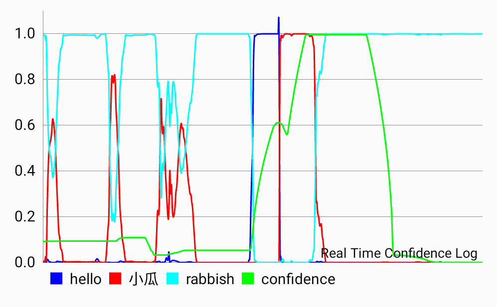

## Simple KWS Demo on Android

### Component
* log-filterbank feature extractor in C(according to HTK, seems out of time)
* simple forword network in C(ReLU and Softmax, only fits for the trainning model)
* data visualization by [MPAndroidChart](https://github.com/PhilJay/MPAndroidChart)
* train the simple model by [keras](https://keras.io/)

### Notes
* nnet and fbank-extractor interface are called through JNI
* trainning scripts are in folder [scripts](scripts), and hdf5tobin.py aims to transfer the model into binary which could be read by the JNI.
* use [OpenBlas](https://github.com/xianyi/OpenBLAS) to optimize forword process like(need to modify the gradle file and add Android.mk and Application.mk):
```c
void forword(vector x, matrix w, vector y, vector b) {
    cblas_scopy(b->size, b->data, 1, y->data, 1);
    cblas_sgemv(CblasRowMajor, CblasNoTrans, y->size, x->size, 1, w->data, x->size, x->data, 1, 1, y->data, 1);
}
```

### Snapshots

